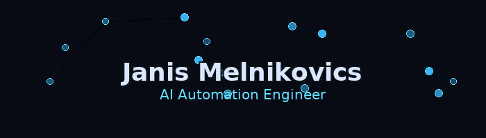

  

  <strong>Power Platform Builder & Automation Engineer · Self-Hosting Specialist</strong> 
  <em>Automate. Ship. Self-host. · Automatisieren. Ausliefern. Selbst hosten.</em>

  
  

---

### 👋 About Me · Über mich

- 🤖 <b>EN:</b> I build real-world automation solutions with a focus on <b>Power Platform</b> and <b>AI-enhanced workflows</b>, often <b>self-hosted</b> on Synology infrastructure.
- 🤖 <b>DE:</b> Ich entwickle praxistaugliche Automatisierungslösungen mit Schwerpunkt auf <b>Power Platform</b> und <b>KI-unterstützten Workflows</b>, meist <b>selbst-gehostet</b> auf Synology.
- 🧠 <b>AI Integration:</b> Daily driver with <b>GPT / Gemini / Claude</b> for intelligent agents, data processing pipelines and DevOps automation.
- ⚡ <b>VibeCoding:</b> Exploring modern UI frameworks only when they accelerate delivery (learning & experimentation).

---

### 🛠️ Core Technologies · Kernkompetenzen

  
  
  
  
  

<i>Continuously learning and experimenting with emerging technologies.</i>

---

### 🚀 Projects in Progress · Laufende Projekte

<table align="center">
  <tr>
    <td width="33%" valign="top">
      <h4>🚀 Tenant-Admin Dashboard (TAD)</h4>
      Desktop application for live tenant metrics via Microsoft Graph. 
      Interactive data visualization and export capabilities.
    </td>
    <td width="33%" valign="top">
      <h4>⚡ PowerShell Skripthub</h4>
      Centralized management for PowerShell script collections. 
      Organize, search and execute scripts from a unified interface.
    </td>
    <td width="33%" valign="top">
      <h4>🤖 DockerMaster NX (Gemini Gem)</h4>
      AI-powered Docker stack optimization for Synology DSM. 
      Intelligent configuration and troubleshooting assistant.
    </td>
  </tr>
  <tr>
    <td width="33%" valign="top">
      <h4>💰 WG-Finance-App Pro</h4>
      Full-stack application for shared household finances. 
      Expense tracking, shopping lists and financial reporting.
    </td>
    <td width="33%" valign="top">
      <h4>⚛️ Modern React Starter</h4>
      Rapid UI/UX development sandbox with modern tooling. 
      Reusable foundation for future web applications.
    </td>
    <td width="33%" valign="top">
      <h4>🌐 Next.js Portfolio</h4>
      Personal website with modern web technologies. 
      Fast, responsive and feature-rich portfolio site.
    </td>
  </tr>
  <tr>
    <td width="33%" valign="top">
      <h4>📱 Flutter VibeCoding App</h4>
      Cross-platform mobile experiments and prototypes. 
      Exploring mobile UI patterns and AI integrations.
    </td>
    <td width="33%" valign="top">
      <h4>🧱 Tenant Scripts & Admin Ops</h4>
      Reusable automation modules for Microsoft 365 admin tasks. 
      Streamlined operations and consistent deployment patterns.
    </td>
    <td width="33%" valign="top">
      <h4>🧪 Misc VibeCoding</h4>
      Experimental projects across AI APIs and tooling. 
      Rapid prototyping and proof-of-concept development.
    </td>
  </tr>
</table>

---

### 📫 Get In Touch · Kontakt

  

