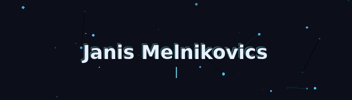

  

  <strong>Power Platform Creator & Digital Solution Builder</strong> 
  <em>Automate. Create. Self-host. · Automatisieren. Erstellen. Selbst hosten.</em>

  
  

---

### 👋 My Approach · Mein Ansatz

- 🎯 I create practical solutions that solve real problems using <b>Power Platform</b> and modern automation techniques.
- 🚀 I specialize in <b>self-hosted</b> solutions on Synology infrastructure for maximum control and privacy.
- 🤖 I leverage <b>AI tools</b> as force multipliers to enhance productivity and enable smarter workflows.
- 💡 I explore emerging technologies through hands-on experimentation and rapid prototyping.

---

### 🛠️ Core Focus Areas · Kernkompetenzen

  
  
  
  

<i>Always learning, always building, always improving.</i>

---

### 🚀 Current Projects · Aktuelle Projekte

<table align="center">
  <tr>
    <td width="33%" valign="top">
      <h4>🚀 Tenant-Admin Dashboard</h4>
      A comprehensive desktop application for Microsoft 365 tenant monitoring. 
      Real-time metrics, interactive visualizations, and automated reporting.
    </td>
    <td width="33%" valign="top">
      <h4>⚡ PowerShell Skripthub</h4>
      A centralized hub for managing and executing PowerShell script collections. 
      Unified interface for organizing, searching, and running automation scripts.
    </td>
    <td width="33%" valign="top">
      <h4>🤖 DockerMaster NX</h4>
      An AI-powered assistant for optimizing Docker deployments on Synology. 
      Intelligent configuration suggestions and troubleshooting guidance.
    </td>
  </tr>
  <tr>
    <td width="33%" valign="top">
      <h4>💰 WG-Finance Pro</h4>
      A full-stack application for shared household financial management. 
      Expense tracking, budget planning, and collaborative financial oversight.
    </td>
    <td width="33%" valign="top">
      <h4>⚛️ Modern React Starter</h4>
      A cutting-edge development environment for rapid UI/UX prototyping. 
      Preconfigured with the latest tools for modern web application development.
    </td>
    <td width="33%" valign="top">
      <h4>🌐 Next.js Portfolio</h4>
      A personal showcase website built with modern web technologies. 
      Responsive design with cutting-edge performance optimizations.
    </td>
  </tr>
  <tr>
    <td width="33%" valign="top">
      <h4>📱 Flutter Playground</h4>
      A sandbox for exploring cross-platform mobile development concepts. 
      Experimentation with UI patterns and mobile AI integrations.
    </td>
    <td width="33%" valign="top">
      <h4>🧱 Admin Toolkit</h4>
      A collection of reusable modules for Microsoft 365 administration. 
      Streamlined operations and consistent deployment methodologies.
    </td>
    <td width="33%" valign="top">
      <h4>🧪 Innovation Lab</h4>
      A space for experimenting with new technologies and proof-of-concepts. 
      Rapid prototyping across emerging tools and platforms.
    </td>
  </tr>
</table>

---

### 📫 Let's Connect · Kontakt

  

