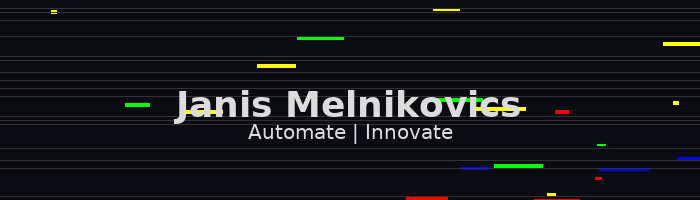

  

<strong>Automate • Innovate • Self-Host</strong>

> **janis@control-room:** _“Automation first, bureaucracy never.”_

| Live Metric       | Status                                                                                                                                              |
|-------------------|-----------------------------------------------------------------------------------------------------------------------------------------------------|
| ⭐ Stars          |                                                              |
| 🐛 Issues         |                                                            |
| 📝 Commits heute  |    |

  
👋 Kurzprofil

- **Rolle:** IT-Consultant · Power Platform Dev
- **Fokus:** Prozess-Automatisierung, Governance, Self-Hosted KI
- **Ziel:** Smarte Lösungen → finanzielle Unabhängigkeit

  
🚀 Aktuelle Projekte

| Projekt                 | Kurzbeschreibung                                                                      |
|-------------------------|---------------------------------------------------------------------------------------|
| **Genehmigungs-Bot**    | Adaptive-Card-Workflow für Urlaubs- & Kostenfreigaben (Power Apps + Power Automate) |
| **Synology Toolstack**  | Docker-Compose-Sammlung (Baserow, Linkwarden, Flowise usw.) für Self-Hosted Productivity |
| **Purview Compliance Lab** | E5-Sandbox zum Testen von Datenklassifizierung, Sensitivity Labels & Retention-Policies |

  <a href="https://www.linkedin.com/in/janismelnikovics">LinkedIn</a> • <a href="https://github.com/melnikovics">GitHub</a>

