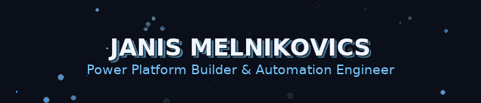

  

  <strong>Power Platform Builder & Automation Engineer · Self-Hosting Specialist</strong> 
  <em>Automate. Ship. Self-host. · Automatisieren. Ausliefern. Selbst hosten.</em>

  
  

---

### 👋 About Me · Über mich

I build real-world automation with <b>Power Platform</b>, <b>PowerShell</b> & <b>Docker</b>, often self-hosted on Synology. I leverage <b>AI tools</b> like GPT, Gemini, Claude, and Llama for agents, data flows, and DevOps helpers. I explore modern UI frameworks only when they accelerate delivery.

---

### 🛠️ Core Technologies · Kernkompetenzen

  <!-- First row -->
  
  
  

  <!-- Second row -->
  
  
  

  <!-- Third row - AI Tools -->
  
  
  

  <!-- Fourth row - More AI Tools -->
  
  
  

<i>Continuously learning and applying these technologies in practical projects.</i>

---

### 🚀 Current Projects · Aktuelle Projekte

<table align="center" style="border-collapse: separate; border-spacing: 15px 15px;">
  <tr>
    <td width="33%" valign="top" style="background-color: #f8f9fa; border-radius: 10px; padding: 15px; box-shadow: 0 4px 6px rgba(0,0,0,0.1);">
      <h4>🚀 Tenant-Admin Dashboard (TAD)</h4>
      
<b>PowerShell + WPF</b> desktop app for live tenant metrics via <b>Microsoft Graph</b>.

      
Interactive tabs, CSV export, secure app-reg auth.

    </td>
    <td width="33%" valign="top" style="background-color: #f8f9fa; border-radius: 10px; padding: 15px; box-shadow: 0 4px 6px rgba(0,0,0,0.1);">
      <h4>⚡ PowerShell Skripthub</h4>
      
<b>.NET 8 + WPF</b> cockpit to manage & run curated <b>PowerShell</b> script sets.

      
MVVM, SQLite, SMA integration.

    </td>
    <td width="33%" valign="top" style="background-color: #f8f9fa; border-radius: 10px; padding: 15px; box-shadow: 0 4px 6px rgba(0,0,0,0.1);">
      <h4>🤖 DockerMaster NX (Gemini Gem)</h4>
      
Custom <b>AI agent</b> that optimizes Docker stacks for <b>Synology DSM</b>.

      
Config + knowledge + troubleshooting hub.

    </td>
  </tr>
  <tr>
    <td width="33%" valign="top" style="background-color: #f8f9fa; border-radius: 10px; padding: 15px; box-shadow: 0 4px 6px rgba(0,0,0,0.1);">
      <h4>💰 WG-Finance-App Pro</h4>
      
Full-stack app for shared finances: expenses, shopping lists.

      
JWT security, Material UI, SQLite.

    </td>
    <td width="33%" valign="top" style="background-color: #f8f9fa; border-radius: 10px; padding: 15px; box-shadow: 0 4px 6px rgba(0,0,0,0.1);">
      <h4>⚛️ Modern React Starter</h4>
      
React 18 + Vite + Tailwind + Redux Toolkit + Framer Motion.

      
Reusable foundation for future SaaS UIs.

    </td>
    <td width="33%" valign="top" style="background-color: #f8f9fa; border-radius: 10px; padding: 15px; box-shadow: 0 4px 6px rgba(0,0,0,0.1);">
      <h4>🌐 Next.js Portfolio</h4>
      
Personal site with Next.js 15, React 19, TS & Tailwind.

      
Server Components & Actions.

    </td>
  </tr>
  <tr>
    <td width="33%" valign="top" style="background-color: #f8f9fa; border-radius: 10px; padding: 15px; box-shadow: 0 4px 6px rgba(0,0,0,0.1);">
      <h4>📱 Flutter VibeCoding App</h4>
      
Cross-platform mobile experiments with theming & routing.

      
Learning project, quick prototypes.

    </td>
    <td width="33%" valign="top" style="background-color: #f8f9fa; border-radius: 10px; padding: 15px; box-shadow: 0 4px 6px rgba(0,0,0,0.1);">
      <h4>🧱 Tenant Scripts & Admin Ops</h4>
      
Reusable <b>PowerShell</b> modules & <b>Graph</b> helpers for Microsoft 365.

      
Packaging + CI, coming public.

    </td>
    <td width="33%" valign="top" style="background-color: #f8f9fa; border-radius: 10px; padding: 15px; box-shadow: 0 4px 6px rgba(0,0,0,0.1);">
      <h4>🧪 Misc VibeCoding</h4>
      
Small agents, scripts & experiments across <b>AI APIs</b> & tooling.

      
Playground, quick wins only.

    </td>
  </tr>
</table>

---

### 📫 Get In Touch

  

---

### 🧬 TECH DNA HELIX

  <i>Your unique combination of skills and expertise:</i>

  <pre>
    <b>Power Platform</b>     <b>Automation</b>     <b>AI Integration</b>     <b>Self-Hosting</b>
         🟣                 🔵                 🟢                 ⚫
         ||                 ||                 ||                 ||
    P P P || A A A A A A || I I I I I I I || S S S S S S S S
    o o w || u u t t t o || n n t t t e g || e e l l h h h t
    w w e || t t o o o m || t t e e e r a || l l f f o o o i
    e e r || o o m m m a || e e l l l t t || f f - - s s s n
    r r P || m m a a a t || l l i i i i i || - - H H t t t g
    P P l || a a t t t i || i i o o o o o || S S y y i i i  
    l l a || t t i i i o || o o n n n n n || y y n n n n n
    a a t || i i o o o n || n n   A A A A || n n   D D D D
    t t f || o o n n n   ||   I I I I I I ||   D D D D D D
    f f o || n n   I I I || I I I I I I I || D D D D D D D
    o o r ||   I I I I I || I I I I I I I || D D D D D D D
    r r m || I I I I I I || I I I I I I I || D D D D D D D
         ||                 ||                 ||                 
         ||                 ||                 ||                 
  </pre>

  

  <i>💡 <b>Genetic Code Analysis:</b> Rare combination of enterprise automation DNA with cutting-edge AI integration capabilities.</i> 
  <i>Want to explore what we can build together? <a href="https://www.linkedin.com/in/janismelnikovics">Let's connect!</a> 🚀</i>

