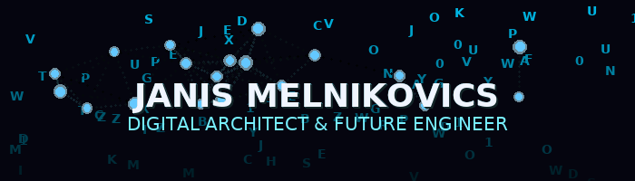

  

  <strong>Quantum Automation Architect · Neural Network Interface Designer</strong> 
  <em>Engineering Tomorrow's Solutions · Gestalten der Lösungen von Morgen</em>

  
  

---

### 🚀 Visionary Approach · Visionärer Ansatz

- 🧠 **Neural Interface Architect**: Engineering human-AI collaboration systems that transcend traditional automation boundaries.
- ⚡ **Quantum Workflow Designer**: Crafting self-evolving digital ecosystems that adapt and optimize in real-time.
- 🤖 **Cognitive Automation Pioneer**: Building intelligent agents that learn, predict, and autonomously solve complex challenges.
- 🔬 **Future Tech Explorer**: Pushing the limits of what's possible through experimental fusion of emerging technologies.

---

### 🛰️ Quantum Focus Domains · Quanten-Fokusdomänen

  
  
  
  

<i>Continuously expanding the boundaries of digital consciousness and computational intelligence.</i>

---

### 🌌 Future Missions · Zukunftsmissionen

<table align="center">
  <tr>
    <td width="33%" valign="top">
      <h4>🚀 T.A.D. Quantum</h4>
      <b>Neural Tenant Analytics Dashboard</b> 
      Holographic real-time Microsoft 365 ecosystem monitoring with predictive anomaly detection. 
      Quantum-encrypted data streams, neural pattern recognition, autonomous threat mitigation.
    </td>
    <td width="33%" valign="top">
      <h4>⚡ NeuroScript Nexus</h4>
      <b>Cognitive PowerShell Orchestration Engine</b> 
      AI-driven script ecosystem with neural learning capabilities and autonomous optimization. 
      Synaptic code evolution, intelligence amplification, quantum execution parallelism.
    </td>
    <td width="33%" valign="top">
      <h4>🤖 SynapseMaster AI</h4>
      <b>Neural Docker Optimization Collective</b> 
      Conscious container orchestration with self-aware infrastructure adaptation. 
      Cognitive resource allocation, neural network topology optimization, quantum state awareness.
    </td>
  </tr>
  <tr>
    <td width="33%" valign="top">
      <h4>💰 QuantumLedger Pro</h4>
      <b>Neuro-Financial Consciousness Network</b> 
      Decentralized financial awareness system with predictive economic modeling. 
      Neural spending pattern analysis, quantum encryption, collective financial intelligence.
    </td>
    <td width="33%" valign="top">
      <h4>⚛️ RealityForge NX</h4>
      <b>Quantum UI/UX Generation Matrix</b> 
      Conscious interface creation engine with adaptive reality distortion capabilities. 
      Neural aesthetic synthesis, quantum interaction modeling, consciousness-responsive design.
    </td>
    <td width="33%" valign="top">
      <h4>🌐 NeuroSphere</h4>
      <b>Digital Consciousness Manifestation Platform</b> 
      Self-evolving personal reality distortion field with neural identity amplification. 
      Quantum presence projection, neural brand enhancement, consciousness expansion protocols.
    </td>
  </tr>
  <tr>
    <td width="33%" valign="top">
      <h4>📱 QuantumPulse Lab</h4>
      <b>Neural Mobile Reality Engine</b> 
      Conscious mobile experience creation with quantum entanglement user interfaces. 
      Neural haptic feedback, quantum gesture recognition, consciousness-embedded interactions.
    </td>
    <td width="33%" valign="top">
      <h4>🧬 AutoAdmin Genome</h4>
      <b>Digital Evolution Administration System</b> 
      Self-replicating administrative DNA with genetic algorithm optimization. 
      Neural policy evolution, quantum deployment sequencing, autonomous governance.
    </td>
    <td width="33%" valign="top">
      <h4>🔮 Innovation Singularity</h4>
      <b>Reality Distortion Research Facility</b> 
      Experimental consciousness expansion laboratory for breakthrough discovery acceleration. 
      Quantum inspiration catalysis, neural creativity amplification, breakthrough emergence.
    </td>
  </tr>
</table>

---

### 📡 Quantum Entanglement · Quantenverschränkung

  

