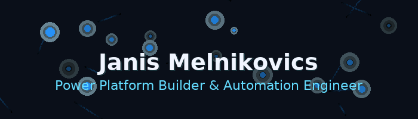

  

  <strong>Power Platform Builder & Automation Engineer · Self-Hosting Specialist</strong> 
  <em>Automate. Ship. Self-host. · Automatisieren. Ausliefern. Selbst hosten.</em>

  
  

---

### 👋 About Me · Über mich

I build real-world automation with <b>Power Platform</b>, <b>PowerShell</b> & <b>Docker</b>, often self-hosted on Synology. I leverage <b>AI tools</b> like GPT, Gemini, Claude, and Llama for agents, data flows, and DevOps helpers. I explore modern UI frameworks like React, Flutter, and Next.js only when they accelerate delivery.

---

### 🛠️ Technologies I Work With · Technologien mit denen ich arbeite

  
  
  
  
  
  
  
  

<i>Continuously learning and applying these technologies in practical projects.</i>

---

### 🚀 Current Projects · Aktuelle Projekte

<table align="center">
  <tr>
    <td width="33%" valign="top">
      <h4>🚀 Tenant-Admin Dashboard (TAD)</h4>
      PowerShell + WPF desktop app for live tenant metrics via Microsoft Graph. 
      Interactive tabs, CSV export, secure app-reg auth.
    </td>
    <td width="33%" valign="top">
      <h4>⚡ PowerShell Skripthub</h4>
      .NET 8 + WPF cockpit to manage & run curated PowerShell script sets. 
      MVVM, SQLite, SMA integration.
    </td>
    <td width="33%" valign="top">
      <h4>🤖 DockerMaster NX (Gemini Gem)</h4>
      Custom AI agent that optimizes Docker stacks for Synology DSM. 
      Config + knowledge + troubleshooting hub.
    </td>
  </tr>
  <tr>
    <td width="33%" valign="top">
      <h4>💰 WG-Finance-App Pro</h4>
      Full-stack React/Node app for shared finances: expenses, shopping lists. 
      JWT security, Material UI, SQLite.
    </td>
    <td width="33%" valign="top">
      <h4>⚛️ Modern React Starter</h4>
      React 18 + Vite + Tailwind + Redux Toolkit + Framer Motion. 
      Reusable foundation for future SaaS UIs.
    </td>
    <td width="33%" valign="top">
      <h4>🌐 Next.js Portfolio</h4>
      Personal site with Next.js 15, React 19, TS & Tailwind. 
      Server Components & Actions.
    </td>
  </tr>
  <tr>
    <td width="33%" valign="top">
      <h4>📱 Flutter VibeCoding App</h4>
      Cross-platform mobile experiments with theming & routing. 
      Learning project, quick prototypes.
    </td>
    <td width="33%" valign="top">
      <h4>🧱 Tenant Scripts & Admin Ops</h4>
      Reusable PowerShell modules & Graph helpers for Microsoft 365. 
      Packaging + CI, coming public.
    </td>
    <td width="33%" valign="top">
      <h4>🧪 Misc VibeCoding</h4>
      Small agents, scripts & experiments across AI APIs & tooling. 
      Playground, quick wins only.
    </td>
  </tr>
</table>

---

### 📫 Get In Touch · Kontakt

  

