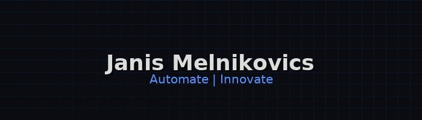

  

  <strong>Power Platform Builder & Automation Engineer · Self-Hosting Builder</strong> 
  <em>Automate. Ship. Self-host. · Automatisieren. Ausliefern. Selbst hosten.</em>

  
  

---

### 👋 About Me · Über mich

- ⚡ <b>EN:</b> I build real-world automation with <b>Power Platform</b>, <b>PowerShell</b> & <b>Docker</b>, often self-hosted on Synology.
- ⚡ <b>DE:</b> Ich baue praxistaugliche Automationen mit <b>Power Platform</b>, <b>PowerShell</b> & <b>Docker</b>, meist <b>self-hosted</b> auf Synology.
- 🤖 <b>AI:</b> Daily driver with <b>GPT / Gemini / Claude / Llama</b> for agents, data flows and DevOps helpers.
- 🧪 <b>VibeCoding:</b> React / Flutter / Next.js only when it accelerates delivery (playground).

---

### 🛠️ Stack I Actually Use · Mein echter Stack

  
  
  
  
  
  
  
  
  

<i>VibeCoding playgrounds: React / Flutter / Next.js (as needed for rapid UI proof-of-concepts).</i>

---

### 🚀 Projects in Progress · Laufende Projekte

<table align="center">
  <tr>
    <td width="33%" valign="top">
      <h4>🚀 Tenant-Admin Dashboard (TAD)</h4>
      <b>PowerShell + WPF</b> desktop app for live tenant metrics via <b>Microsoft Graph</b>. 
      Interactive tabs, CSV export, secure app-reg auth.  
      
      
      
    </td>
    <td width="33%" valign="top">
      <h4>⚡ PowerShell Skripthub</h4>
      .NET 8 + WPF cockpit to manage & run curated <b>PowerShell</b> script sets from one place. 
      MVVM, SQLite, SMA integration.  
      
      
      
    </td>
    <td width="33%" valign="top">
      <h4>🤖 DockerMaster NX (Gemini Gem)</h4>
      Custom AI agent that optimizes Docker stacks for Synology DSM; knowledge-driven workflows. 
      Config + knowledge + troubleshooting hub.  
      
      
      
    </td>
  </tr>
  <tr>
    <td width="33%" valign="top">
      <h4>💰 WG-Finance-App Pro</h4>
      Full-stack <b>React/Node</b> app for shared finances: expenses, shopping lists, PDFs, charts. 
      JWT security, Material UI, SQLite.  
      
      
      
    </td>
    <td width="33%" valign="top">
      <h4>⚛️ Modern React Starter</h4>
      React 18 + Vite + Tailwind + Redux Toolkit + Framer Motion – fast UI/UX sandbox. 
      Reusable foundation for future SaaS UIs.  
      
      
      
    </td>
    <td width="33%" valign="top">
      <h4>🌐 Next.js Portfolio</h4>
      Personal site with Next.js 15, React 19, TS & Tailwind; fast & modern. 
      Server Components & Actions.  
      
      
    </td>
  </tr>
  <tr>
    <td width="33%" valign="top">
      <h4>📱 Flutter VibeCoding App</h4>
      Cross-platform mobile experiments with theming & routing; small AI utilities. 
      Learning project, quick prototypes.  
      
      
    </td>
    <td width="33%" valign="top">
      <h4>🧱 Tenant Scripts & Admin Ops</h4>
      Reusable PowerShell modules & Graph helpers for Microsoft 365 admin tasks. 
      Packaging + CI, coming public.  
      
      
    </td>
    <td width="33%" valign="top">
      <h4>🧪 Misc VibeCoding</h4>
      Small agents, scripts & experiments across AI APIs, dashboards & tooling. 
      Playground, quick wins only.  
      
      
      
    </td>
  </tr>
</table>

---

### 📫 Get In Touch · Kontakt

  

